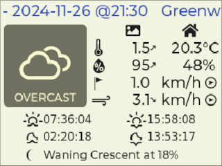
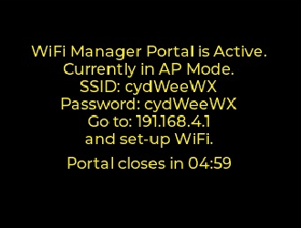
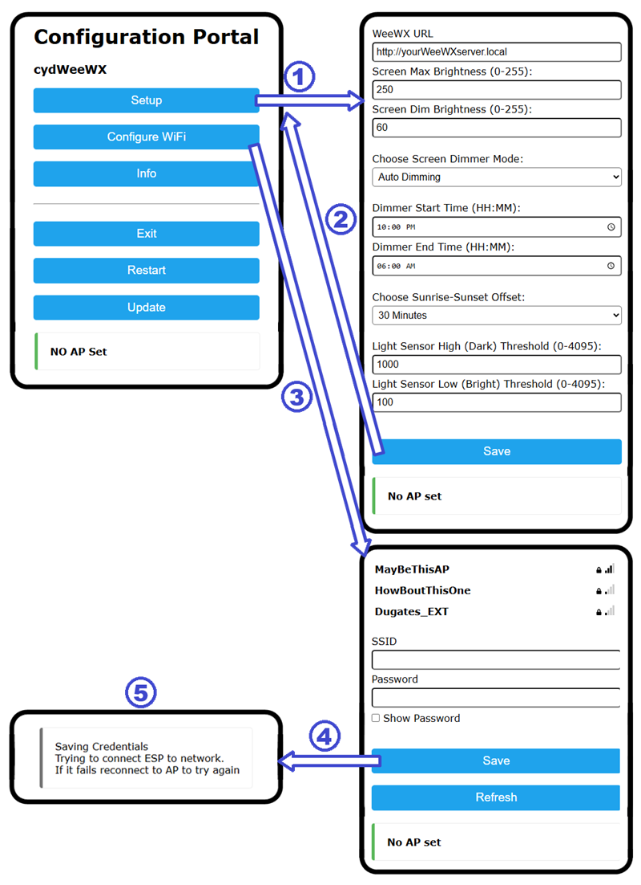
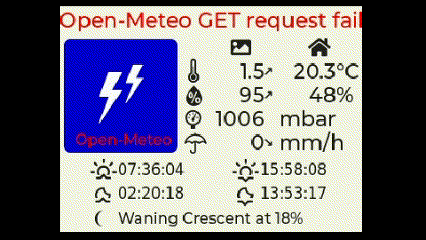
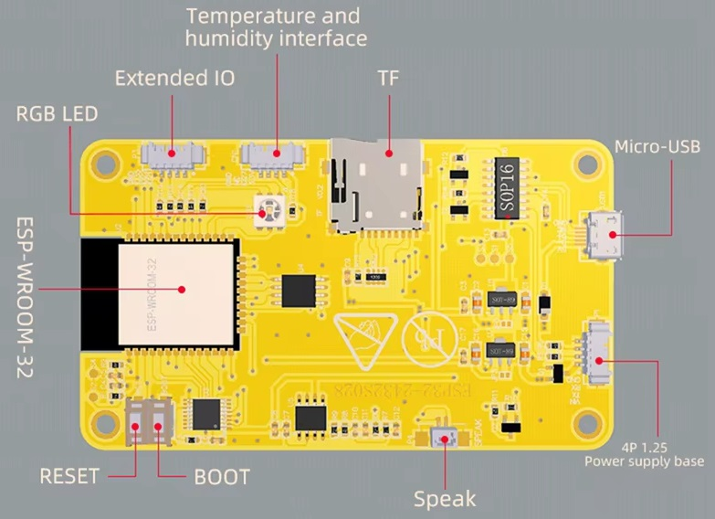
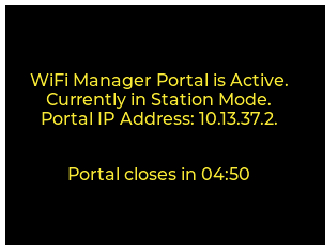
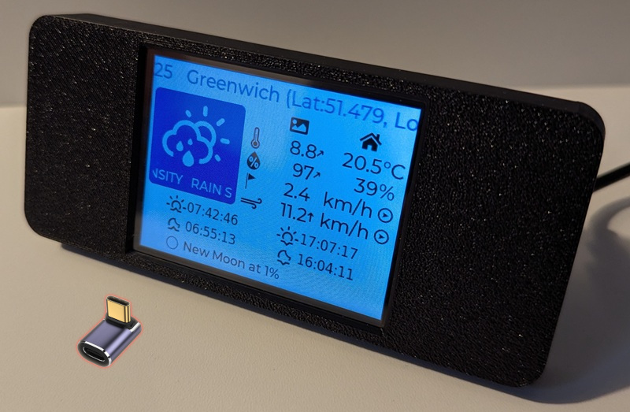

# cydWeeWX
Simple [WeeWX](https://www.weewx.com/) Weather Station Display for the Cheap Yellow Display [(CYD)](https://github.com/witnessmenow/ESP32-Cheap-Yellow-Display).

  

The cydWeeWX is designed for the [ESP32-Cheap-Yellow-Display](https://github.com/witnessmenow/ESP32-Cheap-Yellow-Display) (CYD) which provides a  320 x 240 2.8" LCD display with a touch screen and embedded ESP32. The CYD can usually be found for $10 to $20 from [AliExpress](https://www.aliexpress.com/w/wholesale-esp32-cheap-yellow-display.html?spm=a2g0o.productlist.auto_suggest.2.379fEl3aEl3atZ).

Functionality is fairly simple with a single main display screen and no touch capability implemented. All information except for the WMO Icon and description are pulled from your WeeWX server. The WMO code used for the WMO Icon and Description is pulled from [Open-Meteo](https://open-meteo.com/) using the latitude and longitude from WeeWX. 

The main display shows current weather data including:

* A header with the location, latitude, longitude and last WeeWX weather update date and time.
* WMO icon and weather description from Open-Meteo. Open-Meteo updates this every 15 minutes with the free API service.
* Outdoor and indoor temperature with a trend indicator for the outdoor temperature.
* Outdoor and indoor humidity with a trend indicator for the outdoor humidity.
* Barometric pressure with trend indicator.
* Rain rate with trend indicator.
* Wind speed with trend indicator and wind direction indicator.
* Wind gusts with trend indicator and wind direction indicator.
* Sunrise and Sunset.
* Moonrise and Moonset.
* Moon phase.

All units shown are based on the units provided by the WeeWX data query. Similarly the time is shown assuming the WeeWX query provides local time. The WeeWX data query relies on the installation of the [weewx-json extension](https://github.com/teeks99/weewx-json) modified to also generate a custom JSON report with a new report template, [cyd_weewx.json.tmpl](./WeeWX/cyd_weewx.json.tmpl).

WMO icon and icon colors will change based in whether it is currently night or day. The animated GIF above shows the day version while the night version is below.

  

The cydWeeWX device makes use of the Arduino [WiFi Manager](https://github.com/tzapu/WiFiManager) library to implement a Configuration Portal. The Configuration Portal allows you to set up the WiFi configuration as well as the URL for your WeeWX server.

## Installation

Installing the cydWeeWX firmware on your CYD:

* Got to [Upgrading cydWeeWX Firmware](./cydWeeWX/README.md#upgrading-cydweewx-firmware) for upgrade details.
* Got to [Firmware Installation](./cydWeeWX/README.md#firmware-installation) for installation and build details. Both using the [web based ESP32 flash tool](https://hcomet.github.io/cydWeeWX/cydWeeWXFlash.html) and building from source code are covered.

Then [install and configure](./WeeWX/README.md) the weewx-json extension on your WeeWX server.

## Configuration

When cydWeeWX is booted for the first time the WiFI access and the WeeWX server URL will need to be configured. The cydWeeWX display should look as shown:

  

With a phone, tablet or PC, connect to the cydWeeWX access point at the indicated SSID with the indicated Password. The 4 digit value on the end of the password is randomly generated each time the cydWeeWX reboots. Once connected to the AP, use a browser to go to 194.168.4.1 to see the Configuration Portal main screen.

### Configuration Portal Steps

  

1. Click on the **Setup** button to go to a page where you can enter your WeeWX URL. The URL must start with "_HTTP://_" or "HTTPS//" and end with a slash, "_/_".  
  You may also modify the additional **Setup** parameters at this time or re-enter
  the Configuration Portal after configuring up your WiFi. Details on how to re-enter the Configuration Portal as well as the additional parameters is covered [below](#triggering-the-configuration-portal).
2. Click **Save** to save the WeeWX URL and hit the browser back button to return to the Configuration Portal main page.
3. Now click **Configure WiFi** to go to the WiFi configuration page.
4. Enter the _SSID_ and _Password_ for your WiFI network then click **Save**.
5. At this point cydWeeWX will attempt to connect to your WiFi network and then display your current weather data.

## cydWeeWX Errors

If there is a problem with the WiFi connection or access to the WeeWX server cydWeeWX will enter a critical error state and display an error message in the header. After 5 minutes cydWeeWX will reboot hoping to clear the problem. A countdown will be shown in the weather descriptor.

If there is a problem retrieving Open-Meteo data then cydWeeWX will enter a non-critical error state. WeeWX weather data will continue to update but the Weather Icon and Weather Descriptor will show the Open-Meteo error. Open-Meteo queries will continue to be made every 5 minutes.

  

## Triggering the Configuration Portal

The cydWeeWX can be forced to re-enter Configuration Portal mode by holding down the **BOOT** button on the CYD. The **Boot** button is on the back of the CYD next to the **RESET** button.  Pressing the **RESET** button will cause the cydWeeWX to reboot. See image below.

  

The **BOOT** button needs to be held down for at least **2 seconds** to enter Configuration Mode. The cydWeeWX display will show the following:

  

Connect to the Portal IP address with a browser to access the **Configuration Portal** to modify settings for the cydWeeWX.

**NOTE:** The **Configuration Portal** will time out and close after 5 minutes. A countdown is shown on the cydWeeWX display. Also, holding down the **BOOT** button for 2 or more seconds will force cydWeeWX to exit configuration mode and close the **Configuration Portal**. If the portal closes due to time out or pressing the **BOOT** button, any changes made in the portal will **NOT** be saved. 

## Configuration Portal

The main **Configuration Portal** page presents several buttons to access pages to configure the cydWeeWX.

### Setup

The **Setup** page allows for the configuration of several cydWeeWX parameters. 

#### WeeWX URL:

* Sets the URL used by the cydWeeWX to query your WeeWX server. The URL must start with "_HTTP://_" or "HTTPS//" and end with a slash, "_/_".

#### Screen Max Brightness

* Sets the maximum brightness for the cydWeeWX display. Must be a value from 0 to 255 and greater than or equal to the [Min Brightness](#screen-min-brightness) value. Larger values are brighter.

#### Screen Min Brightness

* Sets the minimum brightness for the cydWeeWX display. Must be a value from 0 to 255 and less than or equal to the [Max Brightness](#screen-max-brightness) value. Smaller values are dimmer.

#### Choose Screen Dimmer Mode

* Select which display screen dimming mode will be used by the cydWeeWX:
  * **No Dimming**: The display will always be at [Max Brightness](#screen-max-brightness) with no dimming.
  * **Auto Dimming**: Display brightness is controlled by the value read from the LDR (Light Dependent Resistor) on the CYD board. This allows for control of the display dimming based on how bright the light is around the cydWeeWX device. The display is set to [Max Brightness](#screen-max-brightness) when the LDR reads a value below the [Light Sensor Low Threshold](#light-sensor-low-bright-threshold-0-4095). The display is set to [Min Brightness](#screen-min-brightness) when the LDR reads a value above [Light Sensor High Threshold](#light-sensor-high-dark-threshold-0-4095). LDR values between the sensor high and low thresholds will generate a proportional display brightness between the Min and Max brightness values.
  * **Scheduled Dimming**: The display is set to [Max Brightness](#screen-max-brightness) except when the local time is between [Dimmer Start Time](#dimmer-start-time-hhmm) and [Dimmer End Time](#dimmer-end-time-hhmm) when it is set to [Min Brightness](#screen-min-brightness). Local time is determined from the WeeWX weather data query.
  * **Sunrise-Sunset Dimming**: The display is set to [Max Brightness](#screen-max-brightness) except when the local time is between sunset plus the [Sunrise-Sunset Offset](#choose-sunrise-sunset-offset) and sunrise minus the [Sunrise-Sunset Offset](#choose-sunrise-sunset-offset) when it is set to [Min Brightness](#screen-min-brightness). Sunrise, sunset and local times are determined from the WeeWX weather data query.

#### Dimmer Start Time (HH:MM)

* Sets the time used to schedule the start of display dimming if the [Screen Dimmer Mode](#choose-screen-dimmer-mode) is set to **Scheduled Dimming**.

#### Dimmer End Time (HH:MM)

* Sets the time used to schedule the end of display dimming if the [Screen Dimmer Mode](#choose-screen-dimmer-mode) is set to **Scheduled Dimming**.

#### Choose Sunrise-Sunset Offset

* Select the offset to adjust display dimming time when the [Screen Dimmer Mode](#choose-screen-dimmer-mode) is set to **Sunrise-Sunset Dimming** mode. Dimming may be adjusted to start and end by an offset of 0, 30 or 60 minutes after Sunset and before Sunrise.

#### Light Sensor High (Dark) Threshold (0-4095)

* Set the LDR (Light Dependent Resistor) sensor threshold value for darkness. Higher values are generated with a darker environment. The value must be between 0 and 4095 and higher than the [Low Threshold](#light-sensor-low-bright-threshold-0-4095).

#### Light Sensor Low (Bright) Threshold (0-4095)

* Set the LDR (Light Dependent Resistor) sensor threshold value for brightness. Lower values are generated with a brighter environment. The value must be between 0 and 4095 and lower than the [High Threshold](#light-sensor-high-bright-threshold-0-4095).

<u>**IMPORTANT:**</u> If you change values on the **Setup** page, click **Save**, then use the browser back arrow to return to the main **Configuration Portal** page. You **MUST** then select **Exit** to shut down the portal or your changes will NOT be saved.

### Configure Wifi

The **Configure WiFi** page may be used to modify the Access Point (AP) settings the cydWeeWX uses for WiFi and internet access. The CYD supports 2.4 GHz Wi-Fi (802.11 b/g/n).

* Any APs broadcasting an SSID within range will be shown at the top of the page. Clicking the **Refresh** button will update this list.
* **SSID**: Enter the SSID of the preferred AP. 
* **Password** Enter the password for the AP.

Clicking on the **Save** button cause the cydWeeWX to attempt to connect to the WiFi AP and exit the **Configuration Portal**.

### Exit

Shuts down the **Configuration Portal** and returns the cydWeeWX to regular operation mode.

### Restart

Reboots the cydWeeWX without saving any configuration changes.

### Update

The **Update** page allows for OTA firmware updates to the cydWeeWX. Use the file chooser to select a file for upload.

## cydWeeWX Case

  

This is a simple 3D printed case designed for the cydWeeWX. The 90 degree angle USB C adapter shown in the lower left of the picture is required to route the USB cable to the back of the case. Four M3x12mm button head screws are required to hold the back on.

Both STL and STEP files for the case can be found in the [cydWeeWX Case](./cydWeeWX%20Case/) folder.

## WOKWi Simulation

The display images shown above were generated using a [WOKWi](https://wokwi.com) simulation of cydWeeWX. The firmware is too large to use directly on the WOKWi web site but it will run using the VS Code plugin. How to set up the VS Code plugin can be found on the [WOKWi](https://docs.wokwi.com/vscode/getting-started) site. Information about how to build cydWeeWX firmware for simulation can be found [here](./WOKWi/README.md).

## Third Party Acknowledgements

* Brian Lough's [ESP32-Cheap-Yellow-Display](https://github.com/witnessmenow/ESP32-Cheap-Yellow-Display/tree/main) site. A great place to go for information on the CYD.
* [WeeWX](https://www.weewx.com/) open source software for your weather station.
* Erik Flowers' [Weather Icons](https://erikflowers.github.io/weather-icons/) site. The icons used in cydWeeWX are LVGL fonts derived from the Weather Icons TTF font created by Erik Flowers. The [weatherIcons_22c.h](./cydWeeWX/weatherIcons_22c.h) and [wmoIcons_64c.h](./cydWeeWX/wmoIcons_64c.h) font files we're produced from the Weather Icons TTF font using the [LVGL Font Converter](https://lvgl.io/tools/fontconverter).
* [DejaVu Fonts](https://dejavu-fonts.github.io/) used to produce the [dejaVuSansCondensed_18c.h](./cydWeeWX/dejaVuSansCondensed_18c.h) font file with the [LVGL Font Converter](https://lvgl.io/tools/fontconverter).
* Web based flash tool provided by [ESP Web Tools](https://esphome.github.io/esp-web-tools/).
