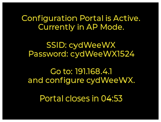
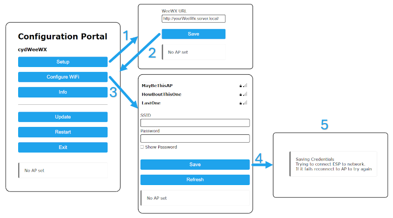
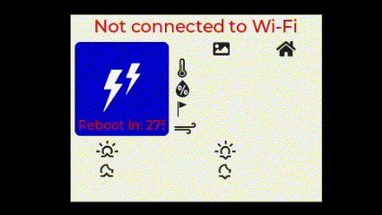
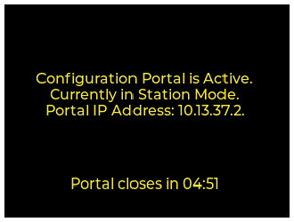

# cydWeeWX
Simple WeeWX Weather Station Display for the Cheap Yellow Display [(CYD)](https://github.com/witnessmenow/ESP32-Cheap-Yellow-Display).

  

The cydWeeWX is designed for the [ESP32-Cheap-Yellow-Display](https://github.com/witnessmenow/ESP32-Cheap-Yellow-Display) (CYD) which provides a  320 x 240 2.8" LCD display with a touch screen and embedded ESP32. The CYD can usually be found for $10 to $20 from [AliExpress](https://www.aliexpress.com/w/wholesale-esp32-cheap-yellow-display.html?spm=a2g0o.productlist.auto_suggest.2.379fEl3aEl3atZ).

Functionality is fairly simple with a single main display screen and no touch capability implemented. All information except for the WMO Icon and description are pulled from your WeeWX server. The WMO code used for the WMO Icon and Description is pulled from [Open-Meteo](https://open-meteo.com/) using the latitude and longitude from WeeWX. 

The main display shows current weather data including:

* A header with the location, latitude, longitude and last WeeWX weather update date and time.
* WMO icon and weather description from Open-Meteo. Open-Meteo updates this every 15 minutes with the free API service.
* Outdoor and indoor temperature with a trend indicator for the outdoor temperature.
* Outdoor and indoor humidity with a trend indicator for the outdoor humidity.
* Barometric pressure with trend indicator.
* Rain rate with trend indicator.
* Wind speed with trend indicator and wind direction indicator.
* Wind gusts with trend indicator and wind direction indicator.
* Sunrise and Sunset.
* Moonrise and Moonset.
* Moon phase.

All units shown are based on the units provided by the WeeWX data query. Similarly the time is shown assuming the WeeWX query provides local time. The WeeWX data query relies on the installation of the [weewx-json extension](https://github.com/teeks99/weewx-json) modified to also generate a custom JSON report with a new report template, [cyd_weewx.json.tmpl](./WeeWX/cyd_weewx.json.tmpl).

WMO icon and icon colors will change based in whether it is currently night or day. The animated GIF above shows the day version while the night version is below.

  

The cydWeeWX device makes use of the Arduino [WiFi Manager](https://github.com/tzapu/WiFiManager) library to implement a Configuration Portal. The Configuration Portal allows you to set up the WiFi configuration as well as the URL for your WeeWX server.

## Configuration

Install the cydWeeWX firmware on you CYD by either:
* building and uploading the firmware yourself using the [build instructions](./cydWeeWX/README.md)
* or, installing a prebuilt image through your browser using this [web based ESP32 flash tool](https://hcomet.github.io/cydWeeWX/cydWeeWXFlash.html). 

Then [install and configure](./WeeWX/README.md) the weewx-json extension on your WeeWX server.

When cydWeeWX is booted for the first time the WiFI access and the WeeWX server URL will need to be configured. The cydWeeWX display should look as shown:

  

With a phone, tablet or PC, connect to the cydWeeWX access point at the indicated SSID with the indicated Password. Then use a browser to go to 194.168.4.1 to see the Configuration Portal main screen.

### Configuration Portal Steps

  

1. Click on the **Setup** button to go to a page where you can enter your WeeWX URL. The URL must start with "_HTTP://_" and end with a slash, "_/_".
2. Click **Save** to save the WeeWX URL and hit the browser back button to return to the Configuration Portal main page.
3. Now click **Configure WiFi** to go to the WiFi configuration page.
4. Enter the _SSID_ and _Password_ for you WiFI network then click **Save**.
5. At this point cydWeeWX will attempt to connect to your WiFi network and then display your current weather data.

If there is a problem with the WiFi connection or access to the WeeWX server cydWeeWX will enter a critical error state and display an error message in the header. After 5 minutes cydWeeWX will reboot hoping to clear the problem. A countdown will be shown in the weather descriptor.

If there is a problem retrieving Open-Meteo data then cydWeeWX will enter a non-critical error state. WeeWX weather data will continue to update but the Weather Icon and Weather Descriptor will show the Open-Meteo error. Open-Meteo queries will continue to be made every 5 minutes.

  

## Triggering the Configuration Portal

The cydWeeWX can be forced to re-enter Configuration Portal mode by holding down the configuration trigger button. cydWeeWX uses the **BOOT** button on the CYD as the trigger button. See image below. Its on the back of the CYD next to the **RESET** button.  Pressing the **RESET** button will cause cydWeeWX to reboot.

  

The **BOOT** button needs to be held down for at least 2 seconds to enter Configuration Mode. The cydWeeWX display will show the following:

  

Follow the [Configuration Steps](#configuration-steps) above to fix either the WiFI configuration or WeeWX URL. If the error is with access to Open-Meteo then you may have an internet access issue.

The Configuration Portal will timeout after 5 minutes. If WiFi connectivity has not been established after the timeout then cydWeeWX will reboot. If there is a WiFi connection established then cydWeeWX will enter weather data display mode. Either clicking on the **EXIT** button in the portal or holding down the **BOOT** button will force cydWeeWX to exit configuration mode.

<u>**IMPORTANT:**</u> If you change the value of the WeeWX URL in the Setup page, click **Save**, then use the browser back arrow to return to the main Configuration Portal page. You **MUST** then select **Exit** to shut down the portal or your changes will NOT be saved.

## cydWeeWX Case

  

This is a simple 3D printed case designed for the cydWeeWX. The 90 degree angle USB C adapter shown in the lower left of the picture is required to route the USB cable to the back of the case. Four M3x12mm button head screws are required to hold the back on.

Both STL and STEP files for the case can be found in the [cydWeeWX Case](./cydWeeWX%20Case/) folder.

## WOKWi Simulation

The display images shown above were generated using a [WOKWi](https://wokwi.com) simulation of cydWeeWX. The firmware is too large to use directly on the WOKWi web site but it will run using the VS Code plugin. How to set up the VS Code plugin can be found on the [WOKWi](https://docs.wokwi.com/vscode/getting-started) site. Information about how to build cydWeeWX firmware for simulation can be found [here](./WOKWi/README.md).

## Third Party Acknowledgements

* Brian Lough's [ESP32-Cheap-Yellow-Display](https://github.com/witnessmenow/ESP32-Cheap-Yellow-Display/tree/main) site. A great place to go for information on the CYD.
* [WeeWX](https://www.weewx.com/) open source software for your weather station.
* Erik Flowers' [Weather Icons](https://erikflowers.github.io/weather-icons/) site. The icons used in cydWeeWX are LVGL fonts derived from the Weather Icons TTF font created by Erik Flowers. The [weatherIcons_22c.h](./cydWeeWX/weatherIcons_22c.h) and [wmoIcons_64c.h](./cydWeeWX/wmoIcons_64c.h) font files we're produced from the Weather Icons TTF font using the [LVGL Font Converter](https://lvgl.io/tools/fontconverter).
* [DejaVu Fonts](https://dejavu-fonts.github.io/) used to produce the [dejaVuSansCondensed_18c.h](./cydWeeWX/dejaVuSansCondensed_18c.h) font file with the [LVGL Font Converter](https://lvgl.io/tools/fontconverter).
* Web based flash tool provided by [ESP Web Tools](https://esphome.github.io/esp-web-tools/).
