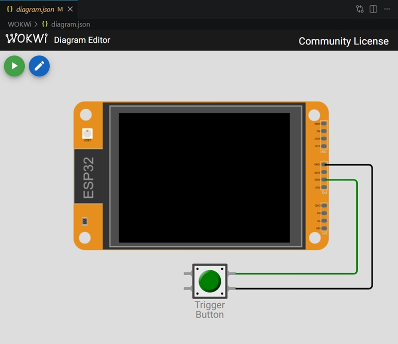

# Set-up for WOKWi Simulator

[WOKWi](https://wokwi.com) provides an emulation environment for IoT devices like the ESP32. A WOKWi account is required to use the simulator. The free version of WOKWi has a limit on the size of firmware that can be compiled and run directly on the site. The cydWeeWX firmware is bigger than that limit,  however there are two options where WOKWi can still be used to simulate cydWeeWX:
* Directly on the WOKWi site. Go to the [cydWeeWX (CYD)](https://wokwi.com/projects/461472545882831873) project on WOKWi and use the upload firmware feature. 
Click into the **diagram.json** tab, press **F1** then select **"Upload Firmware and Start Simulation..."**. You will need to upload a merged binary file build for WOKWi, see [below](#building-cydweewx-for-wokwi).
* Within VS Code using the [WOKWi extension](https://marketplace.visualstudio.com/items?itemName=Wokwi.wokwi-vscode). Details [below](#wokwi-simulator-for-vs-code-configuration).

## Building cydWeeWX for WOKWi

Both WOKWi options require that you download the cydWeeWX project and build your own binary using either the Arduino IDE or VS Code with the [Arduino Community Edition](https://marketplace.visualstudio.com/items?itemName=vscode-arduino.vscode-arduino-community) extension. General build instructions are provided [here](../cydWeeWx/README.md). The following build modifications are also reqired to create a WOKWi compatible build.

First, copy the ***User_Setup.h*** file from the cydWeeWX project ***WOKWi*** folder into the folder where your Arduino TFT_eSPI library is installed.

Second, the cydWeeWX ***cydWeeWXDefines.h*** file  needs to be modified to enable a WOKWi simulator build.

```
#define CYD_WWX_RUN_ON_WOKWI  // Uncomment to  enable creation of a WOKWi simulator build
//#define CYD_WWX_WOKWI_ENTER_AP_AT_BOOT            // Uncomment to force AP entry at boot
//#define CYD_WWX_WOKWI_SHOW_ERROR_STATE            // Uncomment to enter error state on Config Portal exit
```

Addtionally uncommenting either `CYD_WWX_WOKWI_ENTER_AP_AT_BOOT` or `CYD_WWX_WOKWI_SHOW_ERROR_STATE` will cause cydWeeWX to boot into different states in WOKWi.

Both WOKWi options require a merged binary that combines the bootloader, partition table, application code and data partitions. Once you have built your own cydWeeWX binary you will need to go to the build folder and find the ***cydWeeWX.ino.merged.bin*** file. This should be a 4096KB file. 

**IMPORTANT:** Firmware built for the WOKWi Simulator **WILL NOT** run properly on the physical cydWeeWX. You may also need to switch back the ***User_Setup.h*** file to properly support a physical cydWeeWX.

## WOKWi Simulator for VS Code Configuration

1. Install the [WOKWi Simulator for VS Code Configuration](https://marketplace.visualstudio.com/items?itemName=Wokwi.wokwi-vscode) extension, get a free WOKWi account then get an authorization key for the VS Code extension. The link above provides all the information to do this.
2. Install the VS Code [Arduino Community Edition](https://marketplace.visualstudio.com/items?itemName=vscode-arduino.vscode-arduino-community) extension. Be sure to configure a build output folder in the ***.vscode/arduino.json*** configuration file by adding ```"output": "(your build folder path)"```
3. Edit the ***wokwi.toml*** file in the cydWeeWX project ***WOKWi*** folder substituting the relative path from your sketch folder to your build folder for ```(relative path to build folder)```.  
**Note:** The merged binary is required as noted in the [build for WOKWi instructions](#building-cydweewx-for-wokwi).

```yaml
    [wokwi]
        version = 1
        firmware = '(relative path to build folder)/cydWeeWX.ino.merged.bin'
        elf = '(relative path to build folder)/cydWeeWX.ino.elf'
```
4. Move the ***[diagram.json](./diagram.json)*** and modified ***wokwi.toml*** files into your sketch folder.
5. Open the ***diagram.json*** file in VS Code and you should see:



6. Click the WOKWi run button.  
   * Clicking and holding the simulation Trigger Button will enter and exit Configuration Portal mode. The portal on the simulated cydWeeWX cannot be accessed without a paid WOKWi account. This is not needed to play with the simulation.
   * WeeWX data is simulated but actual Open-Meteo queries are made to retrieve the WMO icon and weather description.
