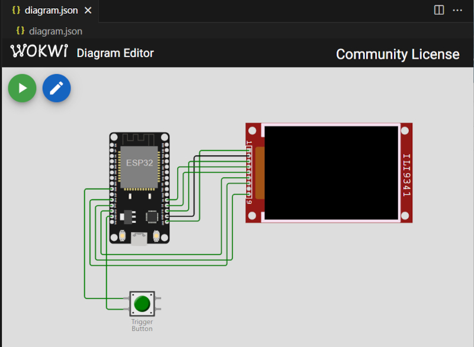

# Set-up for WOKWi Simulator

[WOKWi](https://wokwi.com) provides an emulation environment for IoT devices like the ESP32. The free version of WOKWi has a limit on the size of firmware that can be compiled and run directly on the site. The cydWeeWX firmware is bigger than that limit. However WOKWi can still be used to simulate the cydWeeWX if the compile and build is done on your own computer using  [WOKWi Simulator for VS Code](https://marketplace.visualstudio.com/items?itemName=Wokwi.wokwi-vscode).

1. Install the VS Code extension, get a free WOKWi account then get an authorization key for the VS Code extension. The link above provides all the information to do this.
2. Install the VS Code [Arduino Community Edition](https://marketplace.visualstudio.com/items?itemName=vscode-arduino.vscode-arduino-community) extension. Be sure to configure a build output folder in the ***.vscode/arduino.json*** configuration file by adding ```"output": "(your build folder path)"```
3. Create the ***wokwi.toml*** file in your cydWeeWX sketch folder substituting the relative path from your sketch folder to your build folder for ```(relative path to build folder)```

```yaml
    [wokwi]
        version = 1
        firmware = '(relative path to build folder)/cydWeeWX.ino.bin'
        elf = '(relative path to build folder)/cydWeeWX.ino.elf'
```
4. Copy the ***[diagram.json](./diagram.json)*** file into your sketch folder.
5. Copy the ***[User_Setup.h](./User_Setup.h)*** file into the folder where your Arduino TFT_eSPI library is installed.
6. Modify the cydWeeWX ***cydWeeWXDefines.h*** file to enable a WOKWi simulator build.

    ```
    #define CYD_WWX_RUN_ON_WOKWI  // Uncomment to  enable creation of a WOKWi simulator build
    ```

    **IMPORTANT:** Firmware built for the WOKWi Simulator WILL NOT run properly on the physical cydWeeWX. You may also need to switch back the ***User_Setup.h*** file to properly support a physical cydWeeWX.

7. Build the cydWeeWX firmware in VS Code
8. Open the ***diagram.json*** file in VS Code and you should see:



9. Click the WOKWi run button.  
   * Clicking and holding the simulation Trigger Button will enter and exit Configuration Portal mode. The portal on the simulated cydWeeWX cannot be access without a  paid WOKWi account. This is not needed to play with the simulation.
   * WeeWX data is simulated but actual Open-Meteo queries are made to retrieve the WMO icon and weather description.
