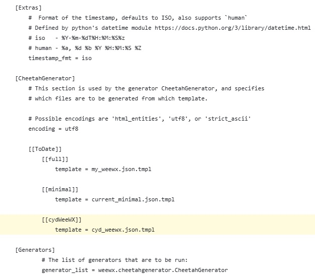

# Installation of the weewx-json Extension 

The cydWeeWX gets the current weather data for your WeeWX weather station using a JSON query to the WeeWX service. This needs to be enabled as follows:
1. Install the [weewx-json](https://github.com/teeks99/weewx-json) extension on your WeeWX server by following the installation instructions on the [GitHub page](https://github.com/teeks99/weewx-json).
2. The cydWeeWX uses a custom report template installed in the weewx-json skins folder. This folder is the ***SKIN_ROOT/JSON*** folder. Should be ***/etc/weewx/skins/JSON*** on many systems.
   1. Copy the [***cyd_weewx.json.tmpl***](./cyd_weewx.json.tmpl) from the set of cydWeeWX release files (found in the ***cydWeeWX/WEEWX*** folder) into the weewx-json folder on your WeeWX server.
   2. Enable the new template by adding it to the weewx-json ***skin.conf*** file in the same folder.  
   This can be done by adding these lines as shown below:

    ```yaml
        [[cydWeeWX]]
            template = cyd_weewx,json.tmpl
    ```

    

3. Do a test run of the new reports using 

    ```weectl report run```

4. Check your WeeWX HTML_ROOT (commonly ***/var/www/html/weew/***) to confirm that a ***cyd_weewx.json*** file was created.

If the file was not created then recheck your WeeWX configuration to make sure that the report is enabled and that your HTML_ROOT is where you are looking.

The ***weewx.conf*** file should have lines that look similar to the following:

```yaml
        [[JSONReport]]
            skin = JSON
            report_timing = */5 * * * *
            enable = true
```

**NOTE:** the ```report_timing = */5 * * * *``` line sets the report to be generated every 5 minutes. You will need to add this if you want the cydWeeWX to display new data every 5 minutes.
